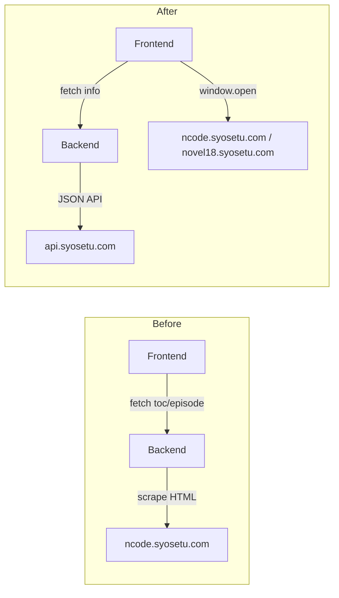

# Design Document: API-Only Reader

## Overview

本設計は、スクレイピングに依存する既存の目次取得・本文表示機能を完全に廃止し、なろう/ノクターン公式APIのみで動作する作品情報表示・リーダーナビゲーション機能を定義する。

**設計方針:**
- バックエンドはHTML解析（BeautifulSoup/lxml）を完全に排除し、公式JSON APIのみを使用する
- 本文表示はアプリ内で行わず、なろう/ノクターンサイトを新タブで直接開く外部リンク方式に変更する
- 既存の `/novel/{ncode}/toc` と `/novel/{ncode}/{episode}` エンドポイントを廃止し、`/novel/{ncode}/info` に置き換える
- フロントエンドは新しいNovelInfoViewコンポーネントで作品メタ情報と話数ナビゲーターを提供する

**主なアーキテクチャ変更:**



## Architecture

### システム構成

```mermaid
flowchart TD
    User[ユーザー] --> FE[Frontend SPA<br/>Vite + React]
    FE -->|GET /api/narou/novel/{ncode}/info<br/>GET /api/nocturne/novel/{ncode}/info| BE[Backend<br/>FastAPI on Cloud Run]
    BE -->|JSON request| NarouAPI[api.syosetu.com/novelapi/api/]
    BE -->|JSON request| R18API[api.syosetu.com/novel18api/api/]
    FE -->|window.open| NarouSite[ncode.syosetu.com/{ncode}/{ep}/]
    FE -->|window.open| NocturneSite[novel18.syosetu.com/{ncode}/{ep}/]
    FE <-->|Firestore SDK| Firestore[(Firestore<br/>favorites collection)]
```

### 設計判断

| 判断 | 選択 | 理由 |
|------|------|------|
| 本文表示方式 | 外部リンク（新タブ） | Cloud Runから403でスクレイピング不可。ユーザーは直接なろうサイトで読む |
| メタ情報取得 | Backend経由でAPI呼び出し | CORSの問題を避け、APIキー管理やレート制限をサーバー側で制御 |
| 既読管理 | Firestoreクライアント直接書き込み | リアルタイム同期が既に実装済み。外部リンククリック時に即座に記録 |
| 話数ナビゲーション | 数値入力 + スライダー | 話数が数百〜数千の作品が多く、直接入力とドラッグの両方が必要 |

## Components and Interfaces

### Backend: 新エンドポイント `/novel/{ncode}/info`

**narou.py** と **nocturne.py** の両方に追加する。

```python
# GET /api/narou/novel/{ncode}/info
# GET /api/nocturne/novel/{ncode}/info
@router.get("/novel/{ncode}/info", response_model=NovelInfoResponse)
async def get_novel_info(ncode: str):
    """
    公式APIから単一作品のメタ情報を取得して返す。
    """
    ...
```

### Backend: 削除するエンドポイント

- `GET /api/narou/novel/{ncode}/toc`
- `GET /api/narou/novel/{ncode}/{episode_number}`
- `GET /api/nocturne/novel/{ncode}/toc`
- `GET /api/nocturne/novel/{ncode}/{episode_number}`

### Backend: 削除する依存

- `beautifulsoup4`
- `lxml`
- スクレイピング用ヘッダー定数（`NAROU_HEADERS`, `NOCTURNE_HEADERS`）
- `_fetch_nocturne_page` ヘルパー関数

### Frontend: 新コンポーネント

| コンポーネント | 責務 |
|---------------|------|
| `NovelInfoView.tsx` | 作品メタ情報表示 + Episode Navigator + 外部リンク + 既読管理UI |
| `EpisodeNavigator` (NovelInfoView内) | 話数選択UI（数値入力 + スライダー） |
| `ExternalReaderLink` (NovelInfoView内) | URL生成 + 新タブオープン + 既読記録トリガー |

### Frontend: 削除するファイル

- `components/NovelToc.tsx`
- `components/NovelReader.tsx`
- `components/SpeechPlayer.tsx`
- `contexts/SpeechContext.tsx`
- `hooks/useVerticalScroll.ts`
- `lib/tcy.ts`

### Frontend: AppViewの変更

```typescript
// Before
export type AppView =
  | { type: "home"; tab: "favorites" | "search" }
  | { type: "toc"; ncode: string; site: SiteMode }
  | { type: "reader"; ncode: string; episode: number; site: SiteMode }
  | { type: "settings" };

// After
export type AppView =
  | { type: "home"; tab: "favorites" | "search" }
  | { type: "info"; ncode: string; site: SiteMode }
  | { type: "settings" };
```

`"toc"` と `"reader"` は `"info"` に統合される。本文閲覧は外部リンクで行うため、アプリ内のreader viewは不要。

### Frontend: FavoritesViewの変更

お気に入り一覧に「続きを読む」/「第1話を読む」/「最新話まで読了」の条件付きボタンを追加する。

## Data Models

### Backend: NovelInfoResponse (新規)

```python
class NovelInfoResponse(BaseModel):
    """作品メタ情報レスポンス（/novel/{ncode}/info 用）"""
    ncode: str = Field(..., description="Nコード")
    title: str = Field(..., description="作品タイトル")
    writer: str = Field(..., description="作者名")
    story: str = Field(..., description="あらすじ")
    genre: int = Field(..., description="ジャンルコード")
    keyword: str = Field(default="", description="キーワード")
    general_all_no: int = Field(..., description="総話数")
    novelupdated_at: str = Field(default="", description="最終更新日時")
```

### Backend: 削除するスキーマ

- `NarouTableOfContents`
- `NarouEpisodeEntry`
- `NarouEpisodeContent`
- `EpisodeContent`
- `NocturneNovelInfo`

### Frontend: NovelInfo型 (新規)

```typescript
export interface NovelInfo {
  ncode: string;
  title: string;
  writer: string;
  story: string;
  genre: number;
  keyword: string;
  general_all_no: number;
  novelupdated_at: string;
}
```

### Frontend: 削除する型

- `EpisodeEntry`
- `TableOfContents`
- `EpisodeContent`

### Frontend: URL生成ユーティリティ

```typescript
/**
 * 外部リーダーURLを生成する。
 * @param ncode - 作品識別子
 * @param episode - 話数（短編の場合はundefinedまたは0）
 * @param site - "narou" | "nocturne"
 */
export function buildExternalReaderUrl(
  ncode: string,
  episode: number | undefined,
  site: SiteMode
): string {
  const base = site === "nocturne"
    ? "https://novel18.syosetu.com"
    : "https://ncode.syosetu.com";
  const ncLower = ncode.toLowerCase();
  if (!episode || episode <= 0) {
    return `${base}/${ncLower}/`;
  }
  return `${base}/${ncLower}/${episode}/`;
}
```

### Frontend: 進捗表示ユーティリティ

```typescript
/**
 * 読書進捗文字列を生成する。
 * @param lastRead - 既読話数（0ならまだ未読）
 * @param total - 全話数（undefinedなら全話数不明）
 * @param suffix - 末尾文字列（" 読了" など）
 */
export function formatProgress(
  lastRead: number,
  total: number | undefined,
  suffix: string = ""
): string {
  if (total !== undefined && total > 0) {
    return `${lastRead}/${total}話${suffix}`;
  }
  return `${lastRead}話${suffix}`;
}
```

## Correctness Properties

*A property is a characteristic or behavior that should hold true across all valid executions of a system—essentially, a formal statement about what the system should do. Properties serve as the bridge between human-readable specifications and machine-verifiable correctness guarantees.*

### Property 1: API応答パース正確性

*For any* 有効なNovel_APIのJSONレスポンス（allcount >= 1、作品データ含む）に対して、`/novel/{ncode}/info` エンドポイントのパース処理は、元のJSONデータに含まれるtitle, writer, story, general_all_no, novelupdated_atフィールドの値を正確に保持したNovelInfoResponseを返す。

**Validates: Requirements 1.1, 6.2**

### Property 2: APIエラー伝播の正確性

*For any* Novel_APIから返されるHTTPエラーステータスコード（4xx, 5xx）に対して、Backend_APIは同じステータスコードカテゴリのHTTPエラーレスポンスを返し、接続失敗の場合は502を返す。

**Validates: Requirements 1.2, 6.4**

### Property 3: Episode Navigator範囲制約

*For any* 正の整数 totalEpisodes に対して、Episode Navigatorは [1, totalEpisodes] の範囲内の値のみを有効として受け付け、範囲外の値（0以下、totalEpisodes超過）を拒否する。

**Validates: Requirements 3.1**

### Property 4: 外部リーダーURL生成

*For any* 有効なncode文字列、正の整数episode、およびSiteMode値に対して、`buildExternalReaderUrl` は以下を満たす:
- site="narou" の場合: `https://ncode.syosetu.com/{ncode小文字}/{episode}/` を返す
- site="nocturne" の場合: `https://novel18.syosetu.com/{ncode小文字}/{episode}/` を返す
- episode が 0 または undefined の場合（短編）: 話数部分を省略した `{base}/{ncode小文字}/` を返す

**Validates: Requirements 4.1, 4.2, 4.4**

### Property 5: 続きを読む話数計算

*For any* お気に入り作品の (lastReadEpisode, totalEpisodes) ペアに対して:
- lastReadEpisode < totalEpisodes の場合: 続きの話数は lastReadEpisode + 1 であり、対応する外部リーダーURLが生成される
- lastReadEpisode >= totalEpisodes の場合: 「最新話まで読了」状態となる
- lastReadEpisode が未定義の場合: 話数 1 を開くURLが生成される

**Validates: Requirements 3.3, 7.2, 7.3, 7.4**

### Property 6: 既読進捗の単調増加性

*For any* 現在の既読話数 currentLastRead と新しいエピソード番号 newEpisode に対して、更新後の既読話数は `max(currentLastRead, newEpisode)` と等しい。既読話数が減少することはない。

**Validates: Requirements 8.3**

### Property 7: 進捗表示フォーマット

*For any* 有効な (lastRead, totalEpisodes) ペアに対して、`formatProgress` 関数は:
- totalEpisodes が正の整数の場合: `"{lastRead}/{totalEpisodes}話{suffix}"` 形式の文字列を返す
- totalEpisodes が undefined の場合: `"{lastRead}話{suffix}"` 形式の文字列を返す
- 返却文字列にはlastReadとtotalEpisodesの値が正確に含まれる

**Validates: Requirements 9.1, 9.2, 9.4**

## Error Handling

### Backend エラーハンドリング

| シナリオ | HTTPステータス | レスポンス |
|----------|--------------|-----------|
| Novel_APIが4xx/5xxを返す | 元のステータスコード | `{"detail": "なろうAPI応答エラー: {code}"}` |
| Novel_APIへの接続タイムアウト | 502 | `{"detail": "なろうAPIへの接続に失敗しました: {error}"}` |
| ncodeに該当する作品なし（allcount=0） | 404 | `{"detail": "指定された作品が見つかりません"}` |
| 不正なAPIレスポンス形式 | 502 | `{"detail": "なろうAPIから不正なレスポンス"}` |

### Frontend エラーハンドリング

| シナリオ | UI表現 |
|----------|--------|
| `/novel/{ncode}/info` が失敗 | エラーメッセージ + 「再試行」ボタン表示 |
| ネットワーク接続なし | 汎用エラーメッセージ |
| Firestore書き込み失敗 | コンソールログ + 次回同期で回復（サイレント） |
| window.openがポップアップブロックされた | ユーザーに直接リンクを表示 |

## Testing Strategy

### プロパティベーステスト (PBT)

本機能は純粋関数（URL生成、進捗フォーマット、範囲バリデーション、パース処理）を多く含むため、PBTが適用可能。

**ライブラリ:**
- Backend (Python): `hypothesis`
- Frontend (TypeScript): `fast-check`

**設定:**
- 各プロパティテストは最低100回のイテレーションを実行
- 各テストにはデザインドキュメントのプロパティ番号をタグ付け
- タグ形式: `Feature: api-only-reader, Property {number}: {property_text}`

### ユニットテスト

| 対象 | テスト内容 |
|------|-----------|
| `get_novel_info` エンドポイント | モックAPIレスポンスに対する正常系・エラー系 |
| `NovelInfoView` コンポーネント | ローディング状態、データ表示、エラー状態 |
| FavoritesView 拡張 | 「続きを読む」ボタン条件分岐 |
| 既読記録ロジック | Firestore呼び出しの検証 |

### 統合テスト

| 対象 | テスト内容 |
|------|-----------|
| Firestore既読更新 | 実際のFirestoreエミュレータでの読み書き |
| お気に入り→外部リンク→既読更新フロー | E2Eワークフロー |

### スモークテスト

| 対象 | テスト内容 |
|------|-----------|
| スクレイピングコード不在 | importチェックでBS4/lxmlが含まれないことを確認 |
| 廃止エンドポイント不在 | `/novel/{ncode}/toc` が404を返すことを確認 |
| 廃止ファイル不在 | NovelToc.tsx, NovelReader.tsx等が存在しないことを確認 |
